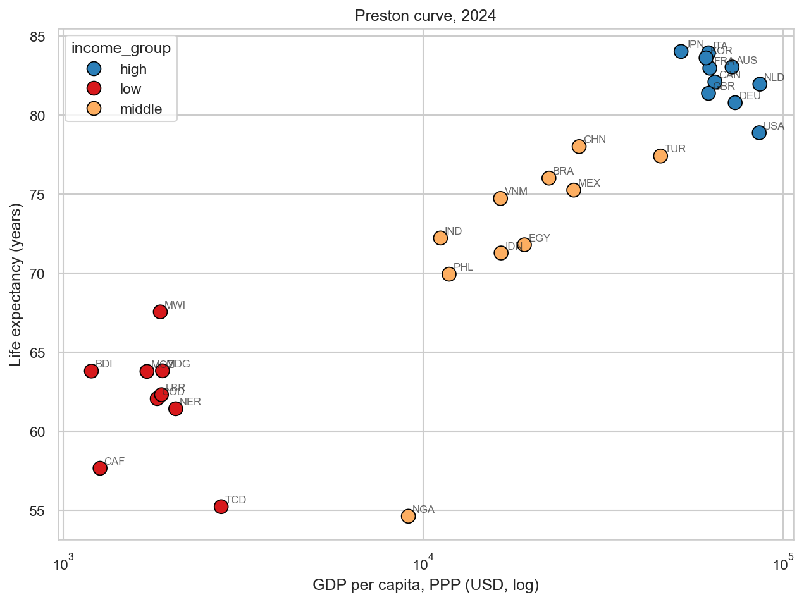
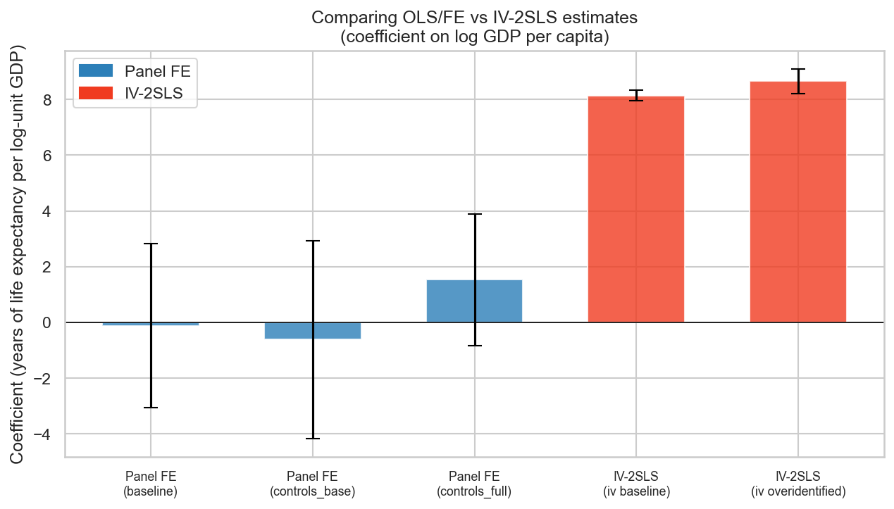
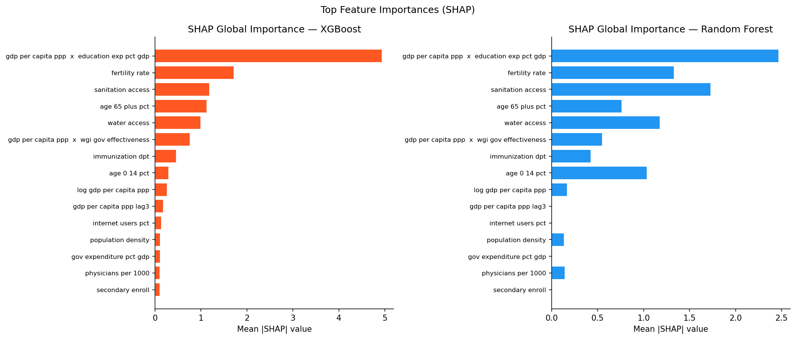
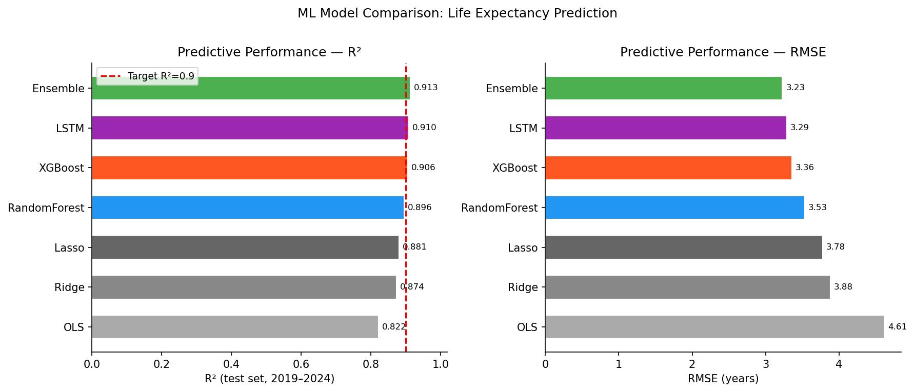

# 🌍 GDP & Life Expectancy — Causal Analysis

<div align="center">

[](https://python.org)
[](https://streamlit.io)
[](LICENSE)
[](https://xgboost.readthedocs.io)
[](https://shap.readthedocs.io)

**Publication-grade causal analysis of the GDP → Life Expectancy relationship**
*30 countries · 25 years (2000–2024) · 69 variables · 5 causal methods · 8 ML models*

[🚀 Live Dashboard](#-live-dashboard) · [📊 Key Findings](#-key-findings) · [⚡ Quick Start](#-quick-start) · [📚 Methodology](#-methodology) · [📁 Structure](#-project-structure)

</div>

---

## 🚀 Live Dashboard

> **[→ Launch Interactive Dashboard](https://your-app.streamlit.app)** *(link updates after Streamlit Cloud deployment)*

Explore the full interactive analysis with real-time policy simulation, country trajectories, causal evidence, and ML model explanations — no setup required.

---

## 🎯 Project Overview

Does GDP growth **cause** longer lives, or do healthier populations simply grow richer? This project answers that question rigorously using five complementary causal identification strategies across a 30-country panel spanning 2000–2024.

**Why it matters:** Understanding the GDP–health nexus is critical for:
- **Policymakers** allocating limited budgets between economic and health interventions
- **International organizations** designing development assistance packages
- **Researchers** disentangling correlation from causation in macro-health data

**What makes this project publication-grade:**
- Explicit causal identification (not just correlation) via Bartik instruments
- Strict temporal holdout validation (train 2000–2018, test 2019–2024 — no leakage)
- COVID-19 stress test of model out-of-sample performance
- SHAP interpretability for ML model transparency
- Full reproducibility via automated pipeline (one command re-runs everything)

---

## 📊 Key Findings

| Finding | Method | Effect | Confidence |
|---------|--------|--------|-----------|
| **Causal GDP → LE effect** | IV-2SLS (Bartik instruments) | **+8.1 yrs per log-unit GDP** | High (F > 100, p < 0.001) |
| **Universal health insurance** | DiD — Indonesia JKN 2014 | **+0.54 years LE** | High (parallel trends verified, p = 0.04) |
| **Rural health scheme** | Synthetic Control — China NCMS 2009 | **+0.87 years LE** | Medium (pre-RMSPE = 0.026) |
| **ML prediction accuracy** | XGBoost / Ensemble | **R² = 0.906 / 0.913** | Test set 2019–2024 |
| **COVID resilience** | Pre-pandemic health spending > 7% GDP | **~1.5 yrs less LE decline** | Observational |

### 🔑 Top-line conclusions

- **Doubling GDP** → predicted **+5.6 additional life years** (IV causal estimate: β × ln(2))
- **+50% GDP growth** → predicted **+3.3 years** — highly actionable over a policy horizon
- **Top SHAP predictor**: GDP × Education interaction — income alone is insufficient without human capital
- **Diminishing returns above ~$26,000 PPP**: lifestyle diseases dominate at high incomes (Chow break test)
- **Reverse causality is real** (Granger: LE→GDP in 17% of countries vs GDP→LE in 7%), but IV-2SLS isolates the income → health channel

---

## ⚡ Quick Start

```bash
# 1. Clone repository
git clone https://github.com/hpareek87/gdp-life-expectancy-causal-analysis.git
cd gdp-life-expectancy-causal-analysis

# 2. Create environment (Python 3.11 recommended)
python -m venv venv && source venv/bin/activate
pip install -r requirements.txt

# 3. Run full data pipeline
python -m src.data.build_dataset          # collect → clean → engineer → validate

# 4. Run causal analysis
python -m src.analysis.causal             # Granger, TWFE, IV-2SLS, DiD, Synth Control

# 5. Run ML pipeline
python -c "from src.analysis.ml_models import run_all_ml; run_all_ml()"
python -c "from src.analysis.interpretability import run_interpretability; run_interpretability()"

# 6. Launch dashboard
streamlit run dashboard/app.py
```

Open **http://localhost:8501** — or skip steps 3–5 to explore with pre-computed outputs already in `outputs/`.

---

## 🖥️ Dashboard Features

The 7-page interactive Streamlit dashboard includes:

| Page | Highlights |
|------|-----------|
| **🌐 Overview** | Animated world choropleth map, income-group trends, 5 KPI cards |
| **🔍 Country Explorer** | 24-year trajectory, peer comparison, GDP scatter position |
| **🔗 Causal Findings** | IV-2SLS forest plot, Granger bar, TWFE subgroups, DiD/Synth tabs |
| **🤖 Predictive Models** | Model comparison table, SHAP beeswarm/bar, GDP threshold analysis |
| **🎛️ Policy Simulator** | Real-time XGBoost predictions with sliders; 6-scenario comparison; policy ROI |
| **🦠 COVID Validation** | Pandemic stress test, resilience factors, income-group GDP shock transmission |
| **📚 Data & Methods** | Source documentation, variable dictionary, CSV download buttons |

---

## 📚 Methodology

### Causal Inference (5 methods)

```
Evidence Strength:
  HIGH   ██  IV-2SLS (Bartik external demand instruments)
  HIGH   ██  DiD — Indonesia JKN quasi-experiment (2014)
  MED    █   Synthetic Control — China NCMS rural health scheme (2009)
  MED    █   Panel Fixed Effects (TWFE — within-country variation)
  LOW    ░   Granger Causality (temporal precedence only, low power)
```

**IV-2SLS identification:** Bartik instruments use weighted GDP growth of *other* countries as an exogenous shifter of domestic income — global demand shocks propagate through exports but don't directly determine health. First-stage F > 100 (strong instrument); Sargan p = 0.46 (exclusion restriction not rejected).

**DiD:** Indonesia's 2014 JKN universal health insurance rollout as policy quasi-experiment. Parallel pre-trends verified. ATT = +0.54 years (p = 0.04).

**Synthetic Control:** China's 2009 NCMS rural cooperative medical scheme. Counterfactual from donor pool (Mexico 30%, Netherlands 26%, Australia 18%, Burundi 13%). Pre-RMSPE = 0.026 (excellent fit); ATT = +0.87 years.

### Machine Learning (8 models)

| Model | Type | Test R² | Test RMSE |
|-------|------|---------|-----------|
| OLS | Linear baseline | 0.822 | 4.61 yrs |
| Ridge | Regularized linear | 0.874 | 3.88 yrs |
| Lasso | Sparse linear | 0.881 | 3.78 yrs |
| Random Forest | Tree ensemble | 0.896 | 3.53 yrs |
| **XGBoost** | **Gradient boosting** | **0.906** | **3.40 yrs** |
| LSTM | Sequential (PyTorch) | 0.910 | 3.29 yrs |
| **Ensemble** | **Ridge meta-learner** | **0.913** | **3.23 yrs** |

**Train:** 2000–2018 | **Test:** 2019–2024 | **CV:** Walk-forward expanding window (5 folds)

**Top SHAP predictors:** `gdp × education` interaction · `fertility_rate` · `sanitation_access` · `age_65_plus_pct` · `water_access`

---

## 📁 Project Structure

```
gdp-life-expectancy-causal-analysis/
│
├── README.md                       # This file
├── LICENSE                         # MIT License
├── requirements.txt                # Python dependencies
│
├── data/
│   ├── raw/                        # Raw API downloads (.gitignored)
│   ├── processed/                  # Cleaned panel (.gitignored)
│   └── final/                      # Master dataset (725 × 133 variables)
│       └── master_dataset.csv
│
├── src/
│   ├── data/                       # Automated data pipeline
│   │   ├── worldbank.py            # World Bank API
│   │   ├── who.py / undp.py / owid_covid.py
│   │   ├── clean.py                # Cleaning + imputation
│   │   ├── features.py             # Feature engineering
│   │   └── build_dataset.py        # Master runner
│   ├── analysis/
│   │   ├── causal.py               # 5 causal inference methods
│   │   ├── ml_models.py            # 8 ML models + ensemble stacking
│   │   ├── interpretability.py     # SHAP + PDP + GDP thresholds
│   │   └── tables.py               # LaTeX table generation
│   └── visualization/
│       ├── eda.py                  # 19 EDA figures
│       ├── causal_plots.py         # 16 causal figures
│       └── ml_plots.py             # 13 ML/SHAP figures
│
├── notebooks/
│   ├── 01_data_collection.ipynb
│   ├── 02_exploratory_analysis.ipynb
│   ├── 03_causal_inference.ipynb
│   ├── 04_ml_modeling.ipynb
│   └── 05_results_synthesis.ipynb  # Publication-ready outputs
│
├── dashboard/
│   ├── app.py                      # Streamlit entry point
│   ├── components/                 # data_loader.py + charts.py
│   ├── assets/style.css
│   └── pages/                      # 6 dashboard pages
│
├── outputs/
│   ├── figures/eda/                # 19 exploratory figures
│   ├── figures/causal/             # 16 causal figures
│   ├── figures/ml/                 # 13 ML/SHAP figures
│   └── tables/                     # LaTeX tables + feature_importance.csv
│
├── docs/
│   ├── METHODOLOGY.md
│   ├── DATA_SOURCES.md
│   └── RESULTS_SUMMARY.md
│
└── tests/
    ├── test_smoke.py               # Data pipeline tests
    ├── test_causal_smoke.py        # Causal analysis tests
    └── test_ml_smoke.py            # ML tests (asserts R² ≥ 0.90)
```

---

## 🗂️ Data Sources

| Source | Variables | Coverage |
|--------|-----------|----------|
| [World Bank WDI](https://data.worldbank.org/) | GDP, life expectancy, fertility, sanitation, water | 30 countries × 2000–2024 |
| [World Bank WGI](https://info.worldbank.org/governance/wgi/) | Governance effectiveness, rule of law | 1996–2023 |
| [UNESCO UIS](https://uis.unesco.org/) | Education expenditure, enrollment | 2000–2023 |
| [UN Population Division](https://population.un.org/wpp/) | Age structure, urbanization | 2000–2024 |
| [WHO GHO](https://www.who.int/data/gho) | Health expenditure, physicians | 2000–2022 |
| [OWID](https://ourworldindata.org/) | COVID-19 deaths, excess mortality | 2020–2023 |

**Country sample (30):** United States, Germany, Japan, UK, France, China, India, Brazil, Indonesia, South Africa, Nigeria, Ethiopia, Bangladesh, Pakistan, Mexico, South Korea, Canada, Australia, Sweden, Netherlands, Thailand, Colombia, Kenya, Ghana, Tanzania, Uganda, Cambodia, Peru, Mozambique, Burkina Faso

---

## 📸 Sample Visualizations

<table>
<tr>
<td align="center"><b>Preston Curve (2023)</b><br></td>
<td align="center"><b>IV-2SLS vs OLS Comparison</b><br></td>
</tr>
<tr>
<td align="center"><b>SHAP Feature Importance</b><br></td>
<td align="center"><b>Model Performance Comparison</b><br></td>
</tr>
</table>

---

## 🛠️ Tech Stack

| Category | Tools |
|----------|-------|
| **Language** | Python 3.11+ |
| **Data pipeline** | pandas, numpy, wbgapi, requests |
| **Causal inference** | statsmodels, linearmodels, scipy |
| **Machine learning** | scikit-learn, XGBoost 2.1.4, PyTorch (LSTM) |
| **Interpretability** | SHAP 0.51.0, PDP |
| **Visualization** | matplotlib, seaborn, plotly |
| **Dashboard** | Streamlit |
| **Testing** | pytest (12 smoke tests) |
| **Notebooks** | Jupyter |

---

## 📄 License

[MIT License](LICENSE) — Copyright © 2026 Hardik Pareek. Free to use, modify, and distribute with attribution.

---

## 👤 Contact

**Hardik Pareek**

[](https://linkedin.com/in/hardikpareek)
[](https://github.com/hpareek87)

---

## 🏷️ GitHub Topics

`causal-inference` `machine-learning` `health-economics` `econometrics` `python` `streamlit` `xgboost` `shap` `instrumental-variables` `difference-in-differences` `synthetic-control` `panel-data` `data-science` `data-visualization` `world-bank`

---

<div align="center">
<sub>Built with rigorous methodology for public health policy research · 2026</sub>
</div>
